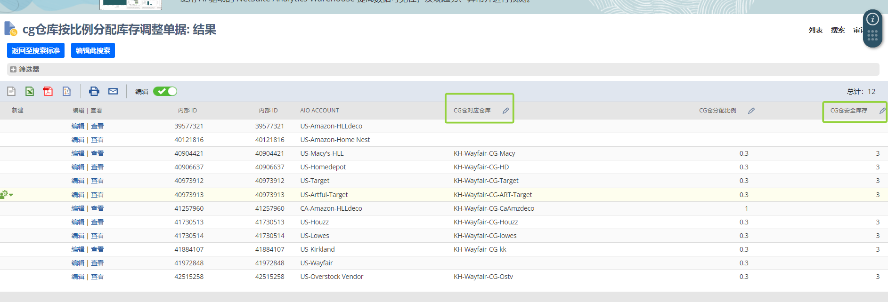
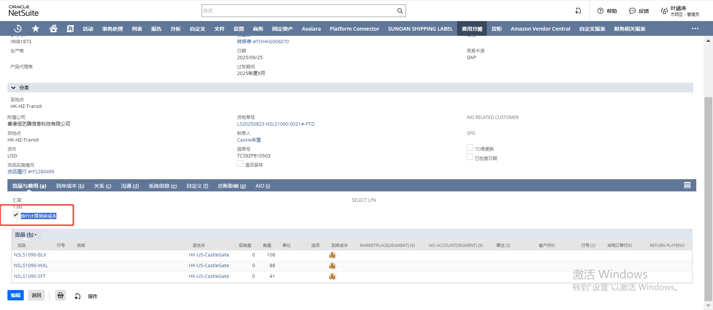
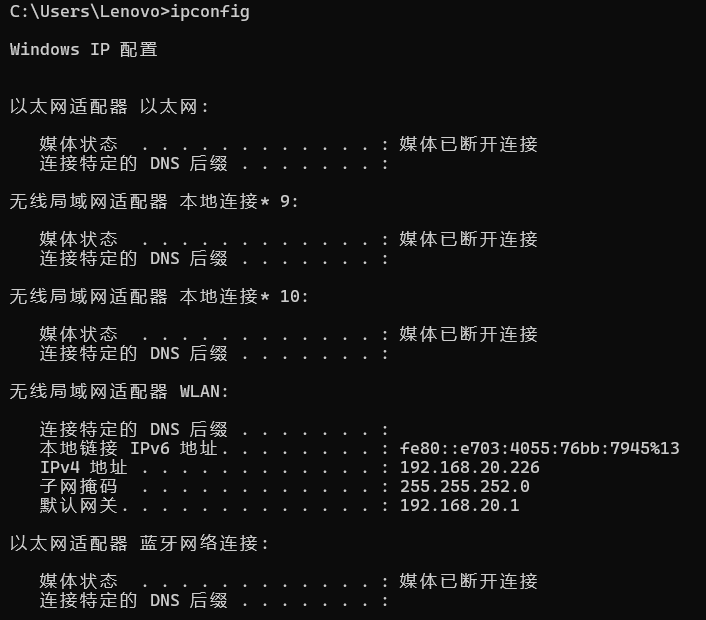

[TOC]
# 基础信息录入
## 货品相关
自定义记录-品类，csv批量导入会重复，需去重后导入
# 财务模块
## 知识拓展
### Klarna账户
Klarna 账户就是你在 Klarna 平台（一家总部在瑞典的金融科技公司）开设的用户账户。它主要用来进行 “先买后付”（Buy Now, Pay Later, BNPL） 或分期付款购物服务。
开通 Klarna 账户后，你可以：  
* 分期付款：把购物金额分成几次（常见是 4 次）在之后的账单中付款。
* 延迟付款：先下单收货，再在 14 或 30 天内付款。
* 一次性支付：也可以直接全额支付，就像普通支付账户。
* 集中管理订单：在 Klarna 的账户里能看到所有购物记录、还款计划、账单提醒。
* 信用评估：每次下单 Klarna 可能会做轻微的信用检查（soft credit check），不会影响信用分数，但长期不按时还款可能会被收债公司追讨并影响信用。
> 简单来说，Klarna 账户 = 一个集支付、分期、订单管理于一体的数字钱包账户，常用于欧美各大电商购物。

| 功能/特点 | **Klarna 账户** | **PayPal 账户** | **信用卡账户** |
|-----------|----------------|----------------|----------------|
| **主要用途** | 先买后付（BNPL）、分期付款、延迟支付 | 在线支付、收款、转账 | 信用消费、分期、透支 |
| **支付方式** | 分期（常见 4 期免息）、14/30 天后付款、一次性支付 | 余额支付 / 绑定银行卡 / 信用卡支付 | 先消费，后还款（通常每月账单） |
| **开通条件** | 需要手机号/邮箱 + 基本身份验证（部分地区会做轻信用检查） | 邮箱注册 + 银行卡/信用卡绑定 | 银行审批（需要信用资质、收入证明等） |
| **信用检查** | 每次下单可能做 soft credit check（不影响信用分数），逾期会影响信用 | 无信用检查 | 正式信用检查，影响信用分数 |
| **利息/费用** | 免息（若逾期则收取滞纳金或罚息） | 基本无利息（货币转换、收款可能收费） | 免息期后未还清收取利息，分期有手续费 |
| **购物体验** | 下单时无需全额付款，更灵活 | 快捷支付，买家保护强 | 普遍接受度最高，附带积分/返现 |
| **安全性** | 提供一定的买家保护，避免商家欺诈 | 高级买家保护、交易纠纷解决机制完善 | 信用卡公司/银行提供的防欺诈保障 |
| **适用场景** | 线上购物（Zara、H&M、Amazon 等），年轻用户喜欢分期 | eBay、跨境购物、个人转账 | 线上线下都能用，通用性最强 |

🔑 总结：  
如果经常 网购又想先收货再付款/分期 → Klarna 更合适。  
如果常常需要 跨境支付、收款、转账 → PayPal 更合适。  
如果追求 通用性 + 信用积分/返现 → 信用卡最好。  

# 销售订单
## ZG退款

1. 货品行已开票场景
* 按照退款子记录提供的SKU和各金额信息生成退货授权和贷项通知单。
* 关闭退货授权（我司退款不退货）。
1. 货品行未开票且订单行整行退款
- 关闭SO整行。
- 将对应logistics包裹行标记为已取消。
1. 货品行未开票只部分退货
- 框架已搭建，代码块尚需完善。
1. 存在客户存款时的特殊场景处理
- 尚未开始加入特殊场景处理代码。
1. 无货品时
- 直接生成贷项通知单做销售折让。
- 尚未加入该处理代码。
错误处理机制
- 请确保在执行每一步骤之前检查相关数据的有效性和完整性。
- 在处理过程中，如果遇到任何问题，请记录错误日志并及时通知相关人员。
---
# 供应链物流

## 库存管理
### 平台虚拟仓分仓
* CG库SKU库存分配比例  
* cg仓库按比例分配库存调整单据  
* 操作流程：新建虚拟仓-> 对应店铺要挂上这个虚拟仓 -> 新建调整单 -> `cg仓库按比例分配库存调整单据`里会有这个仓库了，可以在这个页面更新比例，也可以到调整单更新比例

1. 库存同步脚本
## 入库
### 采购货柜单问题
1. **公司间交易报错**,刷新之后 再点 也还是有这个  
    A：sku是非活动，去找采购

2. 首次入库日期 custitem_first_date  
   搜索：SKU首次入库日期-程序用  
   货物收到国外仓库的时候的值
  
---

3. 收货分摊问题
一般收货是在分摊那里收货，不用额外去点转移单收货。如果去转移单点收货，要手动在货品收据这位置勾选上。
例如

# 系统相关

## IP地址信息
1. 内网IP vs. 公网IP
简单理解  
   1. **内网IP（本地IP）**： 这是你的路由器在家庭或办公室内部网络中分配给你电脑的地址。它只在你的局域网内有效，互联网上的其他设备无法直接用这个地址找到你的电脑。格式通常是 192.168.x.x、172.16.x.x 或 10.x.x.x。  
   **用途：** 在家庭网络中连接打印机、访问NAS、或进行局域网文件共享等。
   2. **公网IP**： 这是你的整个家庭或办公室网络在互联网上的“身份证”，由你的网络服务提供商（如电信、联通、移动）分配。整个局域网内的所有设备共用这一个公网IP来访问互联网。  
   **用途：** 当你访问百度、谷歌时，对方网站看到的就是你这个公网IP。
2. 如何查看IP地址
   - **查看内网IP**：
     - Windows：打开命令提示符（cmd），输入 `ipconfig`，找到“IPv4 地址”。
     - Mac/Linux：打开终端，输入 `ifconfig` 或 `ip addr`，找到对应的网络接口下的“inet”地址。
     - 手机：在WiFi设置中查看已连接网络的详情。
   - **查看公网IP**：
     - 直接在浏览器中搜索“我的IP”或访问网站如 [whatismyip.com](https://www.whatismyip.com/)/ [ip.cn](https://ip.cn/)/ [ipinfo.io](https://ipinfo.io/)
     - 路由器管理界面：登录路由器后台，通常在“状态”或“网络”部分可以看到公网IP。
3. IP地址的动态与静态
   - **动态IP**： 大多数家庭网络使用动态IP地址，这意味着每次你连接互联网时，ISP可能会分配一个不同的公网IP。优点是节省IP资源，缺点是地址可能会变化，不适合需要固定地址的服务。
   - **静态IP**： 这是一个固定不变的IP地址，通常需要向ISP申请并支付额外费用。适用于需要远程访问服务器、运行网站或其他需要稳定地址的应用。

# 程序脚本学习
## ava固定税费测试-逻辑说明
### 概述
此用户事件脚本主要用于在销售订单保存前根据特定条件自动计算并设置商品税码和运费税码。脚本的主要功能包括： 
- 地址变更时计算税码。
- 备注触发条件为“固定税码”时重新计算税码。
- 创建销售订单时，如果店铺信用大于0，计算并设置税码。
- 特定店铺（AIO为"193"的店铺）在任何情况下都计算并设置税码。

# Fiona周报

## 2025-09-05 周报内容
新建搜索：预售SKU到货情况
（预售到货每天早9:30推送到运营邮箱）
新建搜索：ZG待做单地址校验异常汇总
新建搜索：ZG_已推单记录_今日备注推送

shopify折扣码导入51502条
tracking more映射和发运条件更新
NS新增店铺US-Macy's-ZG

Missing Order拉单异常跟进
物流货柜分摊异常跟进；
爆仓货柜改仓撤回
CG推单异常订单异常跟进
ZG订单核税、收入核对
预售产品到货数据输出-后面都邮件推送
库存同步和Tracking回传日志检查等日常工作

## 2025-09-12 周报内容
爆仓货柜改仓撤回
Missing Order拉单异常跟进
物流货柜分摊异常跟进
CG推单异常订单异常跟进
ZG订单核税、收入核对
库存同步和Tracking回传日志检查等日常工作

优化日常检查：
CG Multi-Channel核查表--早上11：00推送给交付；
物流单是否分摊--每天17:30推送异常给物流部
公司间交易检查--每天上午9:00推送异常到邮箱；
TO单货品实施上没挂物流单-日常检查--每天17:30推送异常到邮箱
物流单明细行体积&单价为空无法分摊-物流检查--每天17:30推送异常到邮箱
## 2025-09-19 周报内容
ZG订单预收款核对处理
销售包裹行创建异常处理
收集各店铺的后台时区给财务
摩根供应商信息维护
线下B2B新增三个店铺（EU-B2B/CA-B2B/UK-B2B）
高库龄列表更新删减

爆仓货柜改仓撤回
Missing Order拉单异常跟进
物流货柜分摊异常跟进
库存同步和Tracking回传日志检查等日常工作

## 2025-09-26 周报内容  
1. ZG订单预收款核对处理，优化代码以确保店铺信用抵扣推送正确（创建时即固定税率，避免金额为负数时店铺信用抵扣推送失败）；
2. 文件柜上传文件异常排查，是因为采购使用的压缩打包软件不兼容；
3. 针对TK报错的订单新建搜索及时处理，避免反复报错（搜索-货品实施情况-tracking回传店铺报错）；
4. 货柜分摊异常处理；
5. 货柜改仓撤回；
6. 品类信息新增/修改；
7. Missing Order拉单异常跟进；
8. 物流货柜分摊异常跟进；
9. 脚本日志检查；
10. 其他日常工作事项处理
