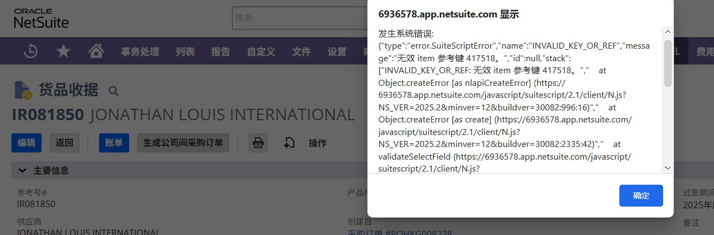
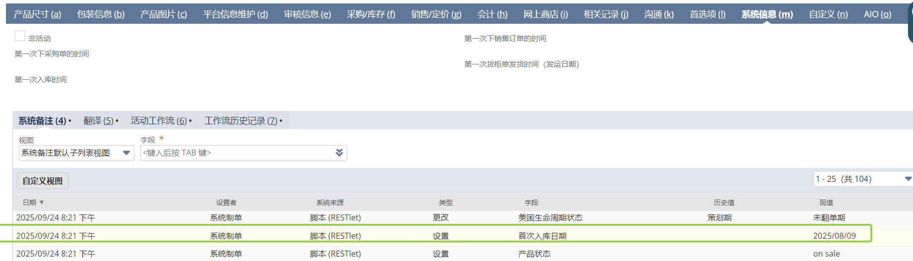

[TOC]
# 基础信息录入
## 货品相关
自定义记录-品类，csv批量导入会重复，需去重后导入
# 销售订单
## ZG退款

1. 货品行已开票场景
- 按照退款子记录提供的SKU和各金额信息生成退货授权和贷项通知单。
- 关闭退货授权（我司退款不退货）。
2. 货品行未开票且订单行整行退款
- 关闭SO整行。
- 将对应logistics包裹行标记为已取消。
3. 货品行未开票只部分退货
- 框架已搭建，代码块尚需完善。
4. 存在客户存款时的特殊场景处理
- 尚未开始加入特殊场景处理代码。
5. 无货品时
- 直接生成贷项通知单做销售折让。
- 尚未加入该处理代码。
错误处理机制
- 请确保在执行每一步骤之前检查相关数据的有效性和完整性。
- 在处理过程中，如果遇到任何问题，请记录错误日志并及时通知相关人员。

# 供应链物流
## 采购货柜单问题
1. **公司间交易报错**,刷新之后 再点 也还是有这个  
    A：sku是非活动，去找采购

2. 首次入库日期 custitem_first_date  
   搜索：SKU首次入库日期-程序用  
   货物收到国外仓库的时候的值
  
---
# 程序脚本学习
## ava固定税费测试-逻辑说明
### 概述
此用户事件脚本主要用于在销售订单保存前根据特定条件自动计算并设置商品税码和运费税码。脚本的主要功能包括： 
- 地址变更时计算税码。
- 备注触发条件为“固定税码”时重新计算税码。
- 创建销售订单时，如果店铺信用大于0，计算并设置税码。
- 特定店铺（AIO为"193"的店铺）在任何情况下都计算并设置税码。
### 主要逻辑
1. 获取上下文记录

var newRecord = context.newRecord;
var AIO = newRecord.getValue("custbody_aio_account");

    | 字段名                                 | 描述                     |
    | -------------------------------------- | ------------------------ |
    | `custbody_aio_account`                 | 自定义字段，AIO账户      |
    | `custbody_ava_disable_tax_calculation` | 自定义字段，禁用税码计算 |
    | `shipstate`                            | 发货州                   |
    | `shipzip`                              | 发货邮编                 |
    | `custbody139`                          | 自定义字段，备注         |
    | `taxamountoverride`                    | 税额覆盖                 |
    | `custbody116`                          | 自定义字段，商品税总额   |
    | `custbody121`                          | 自定义字段，运费税总额   |
    | `subtotal`                             | 商品小计                 |
    | `discounttotal`                        | 折扣总额                 |
    | `itemtype`                             | 项目类型                 |
    | `amount`                               | 项目金额                 |
    | `itemid`                               | 税码ID /税名             |
    | `rate`                                 | 税率                     |
    | `subsidiary`                           | 子公司                   |
    | `taxagency`                            | 税务代理                 |
    | `taxaccount`                           | 纳税科目                 |
    | `description`                          | 描述                     |
    | `otherrefnum`                          | 其他参考号               |
    | `shippingcost`                         | 运费成本                 |
    | `shippingtaxcode`                      | 运费税码                 |
