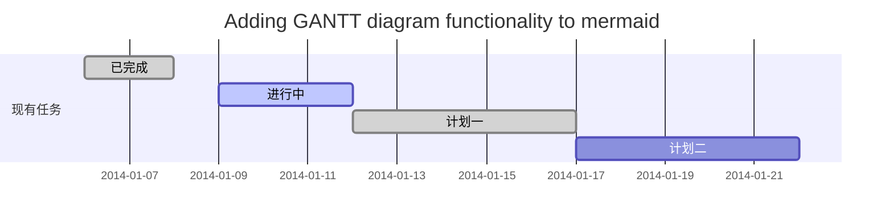
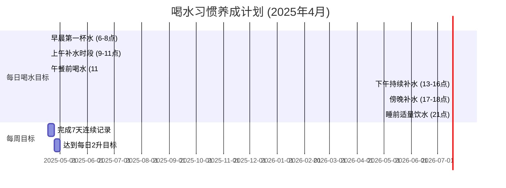
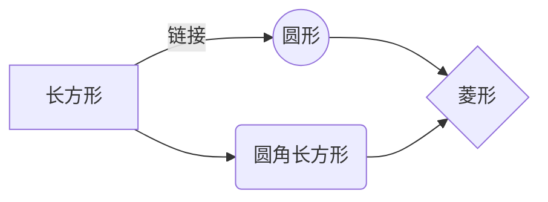

# 作业二： 问卷设计

---


# 躺椅设计需求分析问卷调查

**调查主题：新一代智能躺椅设计需求与市场偏好调研**

**开场语：**  
尊敬的先生/女士，感谢您参与本次调研。我们正在研发一款全新的智能躺椅，您的宝贵意见将直接帮助我们打造更符合您期望的产品。本次调查大约需要8-10分钟，所有数据仅用于内部研究并将严格保密。完成后，您将有机会参与抽奖，赢取精美礼品。

---

## 第一部分：基本信息（用于用户画像与市场细分）

**1. 您的年龄段是？** 【单选题】*  
- [ ] 25岁以下  
- [ ] 26-35岁  
- [ ] 36-45岁  
- [ ] 46-55岁  
- [ ] 56岁及以上 


**2. 您通常会在什么场景下使用躺椅？（最多选3项）** 【多选题】*  
- A. 客厅休闲（看电视、阅读）  
- B. 阳台/花园放松  
- C. 办公室午休  
- D. 户外露营/活动  
- E. 医疗康复  

**3. 您当前使用的躺椅让您最不满意的地方是？** 【多选题】*  
- A. 舒适度不够（材质、角度）  
- B. 功能单一  
- C. 占空间太大  
- D. 不易清洁维护  
- E. 外观老旧  
- F. 其他（请注明）_______  

---

## 第二部分：核心需求与偏好（映射工程范围与质量）

**4. 您认为躺椅的哪些功能至关重要？（请为以下选项排序）** 【排序题】*  
- \_\_\_多角度调节（如看书、休憩、平躺）  
- \_\_\_ 内置储物空间（如放书、遥控器）  
- \_\_\_ 便捷移动（带轮子、轻便）  
- \_\_\_ 易于清洁的材质（防水、防污）  
- \_\_\_ 坚固耐用，承重性好  

**5. 如果引入智能功能，您最感兴趣的是？（最多选3项）** 【多选题】*  
- A. 电动调节（按键/遥控/语音控制）  
- B. 内置按摩/加热功能  
- C. 健康监测（如心率、体动）  
- D. 与环境联动（如自动调节室内灯光）  
- E. 内置音响/USB充电  
- F. 完全不需智能功能  

**6. 对于材质，您更看重？** 【矩阵量表题】*  
（1-完全不重要，5-极其重要）  

| 特性 | 1 | 2 | 3 | 4 | 5 |
|------|---|---|---|---|---|
| 环保性（可持续材料） | ○ | ○ | ○ | ○ | ○ |
| 高级感（如真皮、实木） | ○ | ○ | ○ | ○ | ○ |
| 耐用性（耐磨、抗撕裂） | ○ | ○ | ○ | ○ | ○ |
| 亲肤舒适度（如棉麻、绒布） | ○ | ○ | ○ | ○ | ○ |
| 轻量化（方便移动） | ○ | ○ | ○ | ○ | ○ |

---

## 第三部分：工程与商业权衡（映射成本、风险与采购）

**7. 在“极致舒适”和“轻便易移动”之间，您更倾向于？** 【单选题】*
- A. 绝对追求舒适，可以接受较重  
- B. 更看重轻便易移动，舒适度适中即可  
- C. 希望技术实现两者平衡  











```mermaid
flowchat
    st=>start: 开始
    e=>end: 结束
    op=>operation: 我的操作
    cond=>condition: 确认？
    
    st->op->cond
    cond(yes)->e
    cond(no)->op
```
